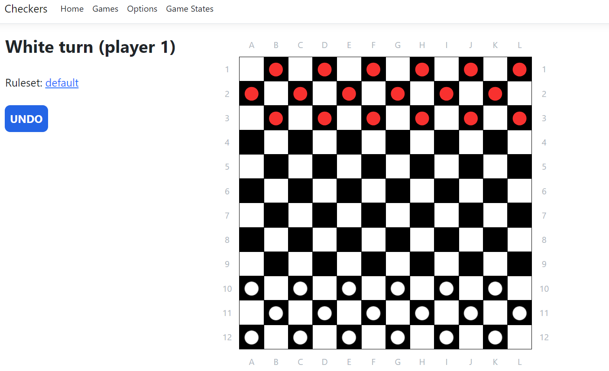
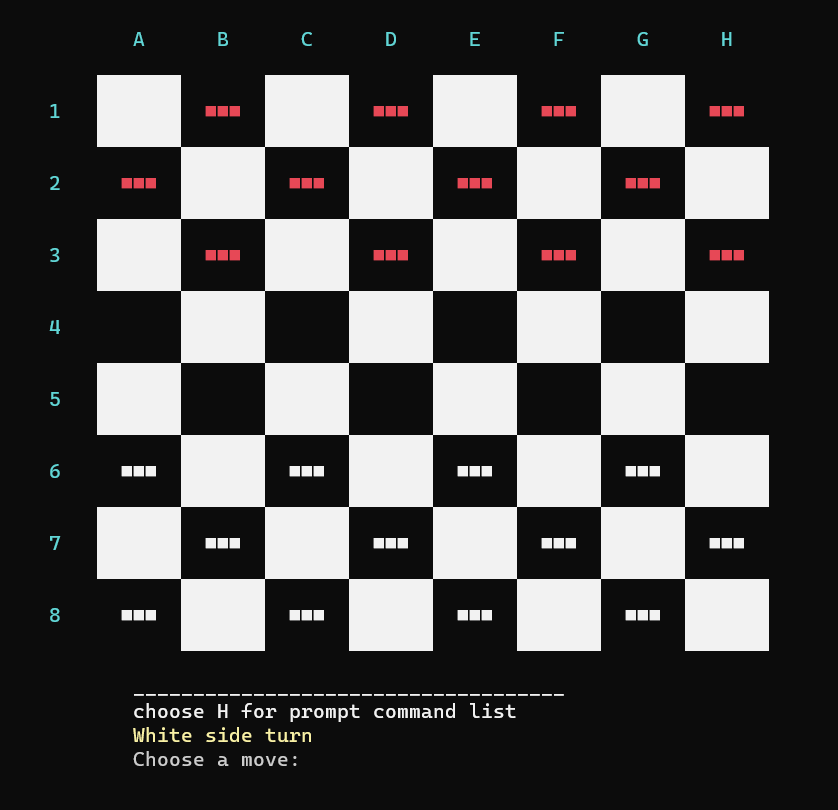

# Checkers webapp + console app

This project was done as coursework at Taltech university. The primary goal of this task was to teach us about separation of concerns, as we were required to make two checkers programs (one console app, other web app) that would use the same internal logic. 

The features available are as follows: 
* Ability to play against AI
* Option to choose width and height of the board (separately)
* Options for various game rules (capture mandatory?, capture backwards allowed? etc.)
* You can use either the SQLite database or file-based saving (web app only supports SQLite)
* Games will be saved after every move. You can continue playing games in progress.

## Screenshots

